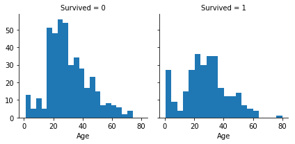
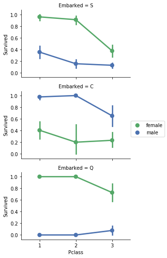
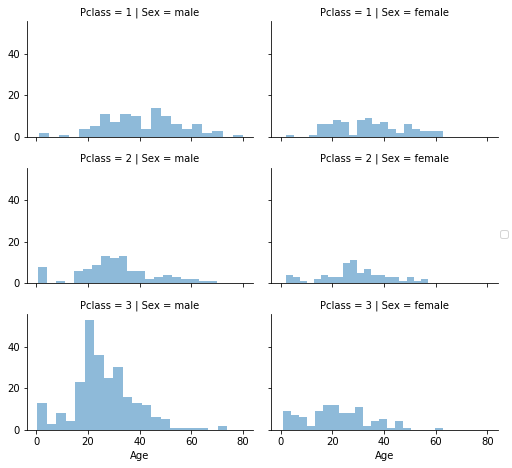

# Data Preparartion

You all might be aware of this term _"Machine Learning"_ but do you know to make our ML model work efficiently, nearly 60-80 percent of the time are cosumed by Data Preperation task. In short, the one slogan every data scientist / Machine Leaning engineer must know i.e. __"Best Data, Best Result"__.

I hope by the end of this tutorial, you may realize the significance of Data Preparation.

To prepare the data ready for our ML model, we have to follow 3 steps in general:
1. Selection of Data
2. Data Preprocessing
3. Transform Data

These steps may be followed in linear manner but it is very likely to be iterative with many loops. In many of the steps, you may require domain knowledge and your hidden talent (common sense).


But before talking about all these steps, I wanted you to download the dataset from the link given below which I'll be using it as an example in this tutorial.

[Click me to download the Titanic Dataset](../1.Data_Preparation/Data)

[Click me to read more information about Titanic Dataset](https://www.kaggle.com/c/titanic/data)


## 1. Selection of Data

This step deals with the selection of subset of all available data. You might be wondering _"why only subset and why not whole data"_. There is a myth amoung most of the young engineers/scietist is that More data results in good ML model. This is may or may not be true my friend.

Before thinking about the selection of data, you should prepare yourself to ask these 3 question to yourself:
1. What are the various data sources, its formats and storages you have available? For example, Sources:Database table, web resources Formats:Text, Images/Videos,  How much size of data you can afford for storage.
2. What data you wished for but not available? The data which is important but not available. This may help you to simulate/derive these data
3. What data don’t you need to address the problem? Insignificant data which is no way required to solve your problem. Note down what to exclude and why.

Now lets try to revise these concept by taking the Titanic dataset example.

Before starting import all the libraries


```python
import os

# data analysis and wrangling
import pandas as pd
import numpy as np
import random as rnd

# visualization
import seaborn as sns
import matplotlib.pyplot as plt
%matplotlib inline
```

Load the dataset using Pandas dataframe.


```python
basePath = os.getcwd()
train_df = pd.read_csv(basePath+'/Data/train.csv')
test_df = pd.read_csv(basePath+'/Data/test.csv')
combine = [train_df, test_df]
```

In this example, you need to predict what sorts of people were likely to survive. There are 12 attributes in this dataset. So as the first step, you have to decide which all attributes contribute to build this prediction model. If you are a beginner in Machine Learning/Data Science field then you might face some difficulties. Don't worry with some experience you will be fluent in such kind of analysis. Check out the reasoning for each attribute given below.

* PassengerId - This is simply an id of integer type which increments by 1 for each entry(row). Thats why it's no way related to other attributes.

* Survived - This will be our predicted class. So we have to include this attribute as a label.

* Pclass(1st=Upper, 2nd=Middle, 3rd=Lower) - This is required because we can assume that Higher class will get higher preference by the rescue team. You can also test and analyse from this 1 line of code.


```python
train_df[['Pclass', 'Survived']].groupby(['Pclass'], as_index=False).mean().sort_values(by='Survived', ascending=False)
```


<div>
<style>
    .dataframe thead tr:only-child th {
        text-align: right;
    }

    .dataframe thead th {
        text-align: left;
    }

    .dataframe tbody tr th {
        vertical-align: top;
    }
</style>
<table border="1" class="dataframe">
  <thead>
    <tr style="text-align: right;">
      <th></th>
      <th>Pclass</th>
      <th>Survived</th>
    </tr>
  </thead>
  <tbody>
    <tr>
      <th>0</th>
      <td>1</td>
      <td>0.629630</td>
    </tr>
    <tr>
      <th>1</th>
      <td>2</td>
      <td>0.472826</td>
    </tr>
    <tr>
      <th>2</th>
      <td>3</td>
      <td>0.242363</td>
    </tr>
  </tbody>
</table>
</div>


* Name - For any Astrologer, Name may be the valuable attribute for them. But for us, we can ignore this also.

* Sex - You may have many reason for inclusion of this attribute. Some may consider Male/Female strength or preference given to them. Thats why we need to include.


```python
train_df[["Sex", "Survived"]].groupby(['Sex'], as_index=False).mean().sort_values(by='Survived', ascending=False)
```


<div>
<style>
    .dataframe thead tr:only-child th {
        text-align: right;
    }

    .dataframe thead th {
        text-align: left;
    }

    .dataframe tbody tr th {
        vertical-align: top;
    }
</style>
<table border="1" class="dataframe">
  <thead>
    <tr style="text-align: right;">
      <th></th>
      <th>Sex</th>
      <th>Survived</th>
    </tr>
  </thead>
  <tbody>
    <tr>
      <th>0</th>
      <td>female</td>
      <td>0.742038</td>
    </tr>
    <tr>
      <th>1</th>
      <td>male</td>
      <td>0.188908</td>
    </tr>
  </tbody>
</table>
</div>


* Age - This may also related to strength and indirectly related to Sex.

We can visualize the Sex and Survived relation as given below.


```python
g = sns.FacetGrid(train_df, col='Survived')
g.map(plt.hist, 'Age', bins=20)
```


    <seaborn.axisgrid.FacetGrid at 0xae5de012b0>





From this graph, we can make some of the important observations:

* Infants (Age <=4) had high survival rate.
* Oldest passengers (Age = 76-80) survived.
* Large number of 16-28 year olds did not survive.
* Most passengers are in 16-36 age range.

From this observation, we can conclude that the Age can also play a vital role to build our model.


* sibsp - At first look you may not find any relation. But we can generate important feature from this attribute by combining them with other attribute. I will show this feature generation step later. 


```python
train_df[["SibSp", "Survived"]].groupby(['SibSp'], as_index=False).mean().sort_values(by='Survived', ascending=False)
```


<div>
<style>
    .dataframe thead tr:only-child th {
        text-align: right;
    }

    .dataframe thead th {
        text-align: left;
    }

    .dataframe tbody tr th {
        vertical-align: top;
    }
</style>
<table border="1" class="dataframe">
  <thead>
    <tr style="text-align: right;">
      <th></th>
      <th>SibSp</th>
      <th>Survived</th>
    </tr>
  </thead>
  <tbody>
    <tr>
      <th>1</th>
      <td>1</td>
      <td>0.535885</td>
    </tr>
    <tr>
      <th>2</th>
      <td>2</td>
      <td>0.464286</td>
    </tr>
    <tr>
      <th>0</th>
      <td>0</td>
      <td>0.345395</td>
    </tr>
    <tr>
      <th>3</th>
      <td>3</td>
      <td>0.250000</td>
    </tr>
    <tr>
      <th>4</th>
      <td>4</td>
      <td>0.166667</td>
    </tr>
    <tr>
      <th>5</th>
      <td>5</td>
      <td>0.000000</td>
    </tr>
    <tr>
      <th>6</th>
      <td>8</td>
      <td>0.000000</td>
    </tr>
  </tbody>
</table>
</div>


* parch - This attribute also have same situtaion what "sibsp" have. Just include this attribute also. We will be using this in feture generation step.


```python
train_df[["Parch", "Survived"]].groupby(['Parch'], as_index=False).mean().sort_values(by='Survived', ascending=False)
```


<div>
<style>
    .dataframe thead tr:only-child th {
        text-align: right;
    }

    .dataframe thead th {
        text-align: left;
    }

    .dataframe tbody tr th {
        vertical-align: top;
    }
</style>
<table border="1" class="dataframe">
  <thead>
    <tr style="text-align: right;">
      <th></th>
      <th>Parch</th>
      <th>Survived</th>
    </tr>
  </thead>
  <tbody>
    <tr>
      <th>3</th>
      <td>3</td>
      <td>0.600000</td>
    </tr>
    <tr>
      <th>1</th>
      <td>1</td>
      <td>0.550847</td>
    </tr>
    <tr>
      <th>2</th>
      <td>2</td>
      <td>0.500000</td>
    </tr>
    <tr>
      <th>0</th>
      <td>0</td>
      <td>0.343658</td>
    </tr>
    <tr>
      <th>5</th>
      <td>5</td>
      <td>0.200000</td>
    </tr>
    <tr>
      <th>4</th>
      <td>4</td>
      <td>0.000000</td>
    </tr>
    <tr>
      <th>6</th>
      <td>6</td>
      <td>0.000000</td>
    </tr>
  </tbody>
</table>
</div>


* ticket - No relation because this can be any arbitrary value.
* fare - This can be also any arbitrary value.
* cabin - It can be any arbitrary value.

So exclude these three attribute also from our list.

* embarked - This attribute is not directly related to survived but having some relation with other attributes. Lets see the relation between embarked, pclass, survived and sex.


```python
grid = sns.FacetGrid(train_df, row='Embarked', size=2.5, aspect=1.6)
grid.map(sns.pointplot, 'Pclass', 'Survived', 'Sex', palette='deep')
grid.add_legend()
```


    <seaborn.axisgrid.FacetGrid at 0xae5dbcc908>





From above graph we can observe that-

* Female passengers had much better survival rate than males.
* Males had worst survival rate in Pclass=3 when compared with other class for S and C ports.
* Exception in Embarked=C where males had higher survival rate.

Based on these observation we should add this attribute also.

So, finally we have completed the first step, where we decided to exclude 5 columns(PassengerId, Name, ticket, fare, cabin).

__Note:__ For more detailed analysis we can add _Name_ and _fare_ also. But I don't want to make things so complex, atleast at this stage. For those people who want more accurate analysis, for them i want to give 1 hint i.e. you can make use of Title from Name and also you can get some information by comparing Embarked, Survived, Sex  and Fare.


```python
train_df = train_df.drop(['Name', 'PassengerId', 'Ticket', 'Fare', 'Cabin'], axis=1)
test_df = test_df.drop(['Name', 'PassengerId', 'Ticket', 'Fare', 'Cabin'], axis=1)
combine = [train_df, test_df]
train_df.shape, test_df.shape
```


    ((891, 7), (418, 6))


# 2. Wrangle Data (Preprocess Data)

After you have selected the data, you need to consider how you are going to use the data. This Wrangling step is about getting the selected data into a form that you can work. 

The 4 common data Wrangling steps are formatting, cleaning and sampling:
1. Formatting: May be the the data on which you are currently working is not correct format. The data may be in a relational database and you would like it in a flat file, or you may want to extract the data from some other resources into an appropriate format. In our example, we already imported dataset from an appropriate file(.csv).

2. Cleaning: Cleaning data is the removal or fixing of missing data. There may be data instances that are incomplete and do not carry the data you believe you need to address the problem. These instances may need to be removed. Additionally, there may be sensitive information in some of the attributes and these attributes may need to be anonymized or removed from the data entirely.

3. Binning: It's a technique used to reduce the effects of minor observation errors. The original data values which fall in a given small interval, a bin, are replaced by a value representative of that interval, often the central value.

4. Sampling: There may be far more selected data available than you need to work with. More data can result in much longer running times for algorithms and larger computational and memory requirements. You can take a smaller representative sample of the selected data that may be much faster for exploring and prototyping solutions before considering the whole dataset. This is also known as __Batching__. We will learn more about this in upcoming tutorials.

## Cleaning

We will first do this for the Age feature.

We can consider three methods to fill the missing values.
* A simple way is to generate random numbers between mean and standard deviation.
*  More accurate way of guessing missing values is to use other correlated features. In our case we note correlation among Age, Gender, and Pclass. Guess Age values using median values for Age across sets of Pclass and Gender feature combinations. So, median Age for Pclass=1 and Gender=0, Pclass=1 and Gender=1, and so on...
* Combine methods 1 and 2. So instead of guessing age values based on median, use random numbers between mean and standard deviation, based on sets of Pclass and Gender combinations.

Method 1 and 3 will introduce some random noise into our models. The results from multiple executions might vary because of filling of missing fields with random values. Thats why, we will prefer method 2.


```python
grid = sns.FacetGrid(train_df, row='Pclass', col='Sex', size=2.2, aspect=1.6)
grid.map(plt.hist, 'Age', alpha=.5, bins=20)
grid.add_legend()
```


    <seaborn.axisgrid.FacetGrid at 0xae5e088ba8>





First of all we have to convert the categorical feature i.e. Sex. It is always better to convert the categorical feature first and then process rest of the step later. Let us start by converting Sex feature to a new feature called Gender where female=1 and male=0.


```python
for dataset in combine:
    dataset['Sex'] = dataset['Sex'].map( {'female': 1, 'male': 0} ).astype(int)

train_df.head()
```


<div>
<style>
    .dataframe thead tr:only-child th {
        text-align: right;
    }

    .dataframe thead th {
        text-align: left;
    }

    .dataframe tbody tr th {
        vertical-align: top;
    }
</style>
<table border="1" class="dataframe">
  <thead>
    <tr style="text-align: right;">
      <th></th>
      <th>Survived</th>
      <th>Pclass</th>
      <th>Sex</th>
      <th>Age</th>
      <th>SibSp</th>
      <th>Parch</th>
      <th>Embarked</th>
    </tr>
  </thead>
  <tbody>
    <tr>
      <th>0</th>
      <td>0</td>
      <td>3</td>
      <td>0</td>
      <td>22.0</td>
      <td>1</td>
      <td>0</td>
      <td>S</td>
    </tr>
    <tr>
      <th>1</th>
      <td>1</td>
      <td>1</td>
      <td>1</td>
      <td>38.0</td>
      <td>1</td>
      <td>0</td>
      <td>C</td>
    </tr>
    <tr>
      <th>2</th>
      <td>1</td>
      <td>3</td>
      <td>1</td>
      <td>26.0</td>
      <td>0</td>
      <td>0</td>
      <td>S</td>
    </tr>
    <tr>
      <th>3</th>
      <td>1</td>
      <td>1</td>
      <td>1</td>
      <td>35.0</td>
      <td>1</td>
      <td>0</td>
      <td>S</td>
    </tr>
    <tr>
      <th>4</th>
      <td>0</td>
      <td>3</td>
      <td>0</td>
      <td>35.0</td>
      <td>0</td>
      <td>0</td>
      <td>S</td>
    </tr>
  </tbody>
</table>
</div>


Let us start by preparing an empty array to contain guessed Age values based on Pclass and Gender combinations.


```python
guess_ages = np.zeros((2,3))
guess_ages
```


    array([[ 0.,  0.,  0.],
           [ 0.,  0.,  0.]])


Now we iterate over Sex (0 or 1) and Pclass (1, 2, 3) to calculate guessed values of Age for the six combinations.


```python
for dataset in combine:
    for i in range(0, 2):
        for j in range(0, 3):
            guess_df = dataset[(dataset['Sex'] == i) & (dataset['Pclass'] == j+1)]['Age'].dropna()

            age_guess = guess_df.median()

            # Convert random age float to nearest .5 age
            guess_ages[i,j] = int( age_guess/0.5 + 0.5 ) * 0.5
            
    for i in range(0, 2):
        for j in range(0, 3):
            dataset.loc[ (dataset.Age.isnull()) & (dataset.Sex == i) & (dataset.Pclass == j+1),\
                    'Age'] = guess_ages[i,j]

    dataset['Age'] = dataset['Age'].astype(int)

train_df.head()
```


<div>
<style>
    .dataframe thead tr:only-child th {
        text-align: right;
    }

    .dataframe thead th {
        text-align: left;
    }

    .dataframe tbody tr th {
        vertical-align: top;
    }
</style>
<table border="1" class="dataframe">
  <thead>
    <tr style="text-align: right;">
      <th></th>
      <th>Survived</th>
      <th>Pclass</th>
      <th>Sex</th>
      <th>Age</th>
      <th>SibSp</th>
      <th>Parch</th>
      <th>Embarked</th>
    </tr>
  </thead>
  <tbody>
    <tr>
      <th>0</th>
      <td>0</td>
      <td>3</td>
      <td>0</td>
      <td>22</td>
      <td>1</td>
      <td>0</td>
      <td>S</td>
    </tr>
    <tr>
      <th>1</th>
      <td>1</td>
      <td>1</td>
      <td>1</td>
      <td>38</td>
      <td>1</td>
      <td>0</td>
      <td>C</td>
    </tr>
    <tr>
      <th>2</th>
      <td>1</td>
      <td>3</td>
      <td>1</td>
      <td>26</td>
      <td>0</td>
      <td>0</td>
      <td>S</td>
    </tr>
    <tr>
      <th>3</th>
      <td>1</td>
      <td>1</td>
      <td>1</td>
      <td>35</td>
      <td>1</td>
      <td>0</td>
      <td>S</td>
    </tr>
    <tr>
      <th>4</th>
      <td>0</td>
      <td>3</td>
      <td>0</td>
      <td>35</td>
      <td>0</td>
      <td>0</td>
      <td>S</td>
    </tr>
  </tbody>
</table>
</div>


Embarked feature takes S, Q, C values based on port of embarkation. Our training dataset has two missing values. We simply fill these with the most common occurance.


```python
freq_port = train_df.Embarked.dropna().mode()[0]
freq_port
```


    'S'


```python
for dataset in combine:
    dataset['Embarked'] = dataset['Embarked'].fillna(freq_port)
    
train_df[['Embarked', 'Survived']].groupby(['Embarked'], as_index=False).mean().sort_values(by='Survived', ascending=False)
```


<div>
<style>
    .dataframe thead tr:only-child th {
        text-align: right;
    }

    .dataframe thead th {
        text-align: left;
    }

    .dataframe tbody tr th {
        vertical-align: top;
    }
</style>
<table border="1" class="dataframe">
  <thead>
    <tr style="text-align: right;">
      <th></th>
      <th>Embarked</th>
      <th>Survived</th>
    </tr>
  </thead>
  <tbody>
    <tr>
      <th>0</th>
      <td>C</td>
      <td>0.553571</td>
    </tr>
    <tr>
      <th>1</th>
      <td>Q</td>
      <td>0.389610</td>
    </tr>
    <tr>
      <th>2</th>
      <td>S</td>
      <td>0.339009</td>
    </tr>
  </tbody>
</table>
</div>


## Binning

Let us create Age bands and determine correlations with Survived.


```python
train_df['AgeBand'] = pd.cut(train_df['Age'], 5)
train_df[['AgeBand', 'Survived']].groupby(['AgeBand'], as_index=False).mean().sort_values(by='AgeBand', ascending=True)
```


<div>
<style>
    .dataframe thead tr:only-child th {
        text-align: right;
    }

    .dataframe thead th {
        text-align: left;
    }

    .dataframe tbody tr th {
        vertical-align: top;
    }
</style>
<table border="1" class="dataframe">
  <thead>
    <tr style="text-align: right;">
      <th></th>
      <th>AgeBand</th>
      <th>Survived</th>
    </tr>
  </thead>
  <tbody>
    <tr>
      <th>0</th>
      <td>(-0.08, 16.0]</td>
      <td>0.550000</td>
    </tr>
    <tr>
      <th>1</th>
      <td>(16.0, 32.0]</td>
      <td>0.337374</td>
    </tr>
    <tr>
      <th>2</th>
      <td>(32.0, 48.0]</td>
      <td>0.412037</td>
    </tr>
    <tr>
      <th>3</th>
      <td>(48.0, 64.0]</td>
      <td>0.434783</td>
    </tr>
    <tr>
      <th>4</th>
      <td>(64.0, 80.0]</td>
      <td>0.090909</td>
    </tr>
  </tbody>
</table>
</div>


Let us replace Age with ordinals based on these bands.


```python
for dataset in combine:    
    dataset.loc[ dataset['Age'] <= 16, 'Age'] = 0
    dataset.loc[(dataset['Age'] > 16) & (dataset['Age'] <= 32), 'Age'] = 1
    dataset.loc[(dataset['Age'] > 32) & (dataset['Age'] <= 48), 'Age'] = 2
    dataset.loc[(dataset['Age'] > 48) & (dataset['Age'] <= 64), 'Age'] = 3
    dataset.loc[ dataset['Age'] > 64, 'Age']
train_df.head()
```


<div>
<style>
    .dataframe thead tr:only-child th {
        text-align: right;
    }

    .dataframe thead th {
        text-align: left;
    }

    .dataframe tbody tr th {
        vertical-align: top;
    }
</style>
<table border="1" class="dataframe">
  <thead>
    <tr style="text-align: right;">
      <th></th>
      <th>Survived</th>
      <th>Pclass</th>
      <th>Sex</th>
      <th>Age</th>
      <th>SibSp</th>
      <th>Parch</th>
      <th>Embarked</th>
      <th>AgeBand</th>
    </tr>
  </thead>
  <tbody>
    <tr>
      <th>0</th>
      <td>0</td>
      <td>3</td>
      <td>0</td>
      <td>1</td>
      <td>1</td>
      <td>0</td>
      <td>S</td>
      <td>(16.0, 32.0]</td>
    </tr>
    <tr>
      <th>1</th>
      <td>1</td>
      <td>1</td>
      <td>1</td>
      <td>2</td>
      <td>1</td>
      <td>0</td>
      <td>C</td>
      <td>(32.0, 48.0]</td>
    </tr>
    <tr>
      <th>2</th>
      <td>1</td>
      <td>3</td>
      <td>1</td>
      <td>1</td>
      <td>0</td>
      <td>0</td>
      <td>S</td>
      <td>(16.0, 32.0]</td>
    </tr>
    <tr>
      <th>3</th>
      <td>1</td>
      <td>1</td>
      <td>1</td>
      <td>2</td>
      <td>1</td>
      <td>0</td>
      <td>S</td>
      <td>(32.0, 48.0]</td>
    </tr>
    <tr>
      <th>4</th>
      <td>0</td>
      <td>3</td>
      <td>0</td>
      <td>2</td>
      <td>0</td>
      <td>0</td>
      <td>S</td>
      <td>(32.0, 48.0]</td>
    </tr>
  </tbody>
</table>
</div>


We can not remove the AgeBand feature.


```python
train_df = train_df.drop(['AgeBand'], axis=1)
combine = [train_df, test_df]
train_df.head()
```


<div>
<style>
    .dataframe thead tr:only-child th {
        text-align: right;
    }

    .dataframe thead th {
        text-align: left;
    }

    .dataframe tbody tr th {
        vertical-align: top;
    }
</style>
<table border="1" class="dataframe">
  <thead>
    <tr style="text-align: right;">
      <th></th>
      <th>Survived</th>
      <th>Pclass</th>
      <th>Sex</th>
      <th>Age</th>
      <th>SibSp</th>
      <th>Parch</th>
      <th>Embarked</th>
    </tr>
  </thead>
  <tbody>
    <tr>
      <th>0</th>
      <td>0</td>
      <td>3</td>
      <td>0</td>
      <td>1</td>
      <td>1</td>
      <td>0</td>
      <td>S</td>
    </tr>
    <tr>
      <th>1</th>
      <td>1</td>
      <td>1</td>
      <td>1</td>
      <td>2</td>
      <td>1</td>
      <td>0</td>
      <td>C</td>
    </tr>
    <tr>
      <th>2</th>
      <td>1</td>
      <td>3</td>
      <td>1</td>
      <td>1</td>
      <td>0</td>
      <td>0</td>
      <td>S</td>
    </tr>
    <tr>
      <th>3</th>
      <td>1</td>
      <td>1</td>
      <td>1</td>
      <td>2</td>
      <td>1</td>
      <td>0</td>
      <td>S</td>
    </tr>
    <tr>
      <th>4</th>
      <td>0</td>
      <td>3</td>
      <td>0</td>
      <td>2</td>
      <td>0</td>
      <td>0</td>
      <td>S</td>
    </tr>
  </tbody>
</table>
</div>


# 3. Transform Data

The final step is to transform the process data. The specific algorithm you are working with and the knowledge of the problem domain will influence this step. You may have to apply various transformations of your preprocessed data as you work on your problem.The three most common data transformations are scaling, attribute decompositions and attribute aggregations. This step is also referred to as __Feature Engineering__.

## Scaling

The preprocessed data may contain attributes with a mixtures of scales for various quantities such as Rupees, Measuring units(Kilogram, Meter) and sales volume. Many machine learning methods like data attributes to have the same scale such as between 0 and 1 for the smallest and largest value for a given feature. Consider any feature scaling you may need to perform. Since we don't have any attribute which has large scale valuea and therefore, we can ignore this step.

## Encoding

As Machine learning method works on numeric data, we have convert all selected attributes contains categorical data in string format. In our example, we already converted one attribute _Sex_ into 0(Male) and 1(Female). Now we will convert _Embarked_ attribute where 'S'= 0, 'C'= 1, 'Q'= 2.


```python
for dataset in combine:
    dataset['Embarked'] = dataset['Embarked'].map( {'S': 0, 'C': 1, 'Q': 2} ).astype(int)

train_df.head()
```


<div>
<style>
    .dataframe thead tr:only-child th {
        text-align: right;
    }

    .dataframe thead th {
        text-align: left;
    }

    .dataframe tbody tr th {
        vertical-align: top;
    }
</style>
<table border="1" class="dataframe">
  <thead>
    <tr style="text-align: right;">
      <th></th>
      <th>Survived</th>
      <th>Pclass</th>
      <th>Sex</th>
      <th>Age</th>
      <th>SibSp</th>
      <th>Parch</th>
      <th>Embarked</th>
    </tr>
  </thead>
  <tbody>
    <tr>
      <th>0</th>
      <td>0</td>
      <td>3</td>
      <td>0</td>
      <td>1</td>
      <td>1</td>
      <td>0</td>
      <td>0</td>
    </tr>
    <tr>
      <th>1</th>
      <td>1</td>
      <td>1</td>
      <td>1</td>
      <td>2</td>
      <td>1</td>
      <td>0</td>
      <td>1</td>
    </tr>
    <tr>
      <th>2</th>
      <td>1</td>
      <td>3</td>
      <td>1</td>
      <td>1</td>
      <td>0</td>
      <td>0</td>
      <td>0</td>
    </tr>
    <tr>
      <th>3</th>
      <td>1</td>
      <td>1</td>
      <td>1</td>
      <td>2</td>
      <td>1</td>
      <td>0</td>
      <td>0</td>
    </tr>
    <tr>
      <th>4</th>
      <td>0</td>
      <td>3</td>
      <td>0</td>
      <td>2</td>
      <td>0</td>
      <td>0</td>
      <td>0</td>
    </tr>
  </tbody>
</table>
</div>


## Decomposition

There may be features that represent a complex concept that may be more useful to a machine learning method when split into the constituent parts. An example is a date that may have day and time components that in turn could be split out further. Perhaps only the hour of day is relevant to the problem being solved. consider what feature decompositions you can perform.

In our example, if we considered the Name attribute then we can extract the Title (Mr, Mrs, Miss, Master and so on) from it and rest of the name can be decomposed. You may ask why __"Title"__? We can assume that a person with high grade title may given higher preference by the rescue team.

## Aggregation

There may be features that can be aggregated into a single feature that would be more meaningful to the problem you are trying to solve. In our example, we can combine _Parch_ and _SibSp_ in order to create a new attribute _FamilySize_. This step will enable us to drop _Parch_ and _SibSp_ from our datasets.


```python
for dataset in combine:
    dataset['FamilySize'] = dataset['SibSp'] + dataset['Parch'] + 1

train_df[['FamilySize', 'Survived']].groupby(['FamilySize'], as_index=False).mean().sort_values(by='Survived', ascending=False)
```


<div>
<style>
    .dataframe thead tr:only-child th {
        text-align: right;
    }

    .dataframe thead th {
        text-align: left;
    }

    .dataframe tbody tr th {
        vertical-align: top;
    }
</style>
<table border="1" class="dataframe">
  <thead>
    <tr style="text-align: right;">
      <th></th>
      <th>FamilySize</th>
      <th>Survived</th>
    </tr>
  </thead>
  <tbody>
    <tr>
      <th>3</th>
      <td>4</td>
      <td>0.724138</td>
    </tr>
    <tr>
      <th>2</th>
      <td>3</td>
      <td>0.578431</td>
    </tr>
    <tr>
      <th>1</th>
      <td>2</td>
      <td>0.552795</td>
    </tr>
    <tr>
      <th>6</th>
      <td>7</td>
      <td>0.333333</td>
    </tr>
    <tr>
      <th>0</th>
      <td>1</td>
      <td>0.303538</td>
    </tr>
    <tr>
      <th>4</th>
      <td>5</td>
      <td>0.200000</td>
    </tr>
    <tr>
      <th>5</th>
      <td>6</td>
      <td>0.136364</td>
    </tr>
    <tr>
      <th>7</th>
      <td>8</td>
      <td>0.000000</td>
    </tr>
    <tr>
      <th>8</th>
      <td>11</td>
      <td>0.000000</td>
    </tr>
  </tbody>
</table>
</div>


We can create another feature called _IsAlone_.


```python
for dataset in combine:
    dataset['IsAlone'] = 0
    dataset.loc[dataset['FamilySize'] == 1, 'IsAlone'] = 1

train_df[['IsAlone', 'Survived']].groupby(['IsAlone'], as_index=False).mean()
```


<div>
<style>
    .dataframe thead tr:only-child th {
        text-align: right;
    }

    .dataframe thead th {
        text-align: left;
    }

    .dataframe tbody tr th {
        vertical-align: top;
    }
</style>
<table border="1" class="dataframe">
  <thead>
    <tr style="text-align: right;">
      <th></th>
      <th>IsAlone</th>
      <th>Survived</th>
    </tr>
  </thead>
  <tbody>
    <tr>
      <th>0</th>
      <td>0</td>
      <td>0.505650</td>
    </tr>
    <tr>
      <th>1</th>
      <td>1</td>
      <td>0.303538</td>
    </tr>
  </tbody>
</table>
</div>


Let us drop _Parch_, _SibSp_, and _FamilySize_ features in favor of _IsAlone_.


```python
train_df = train_df.drop(['Parch', 'SibSp', 'FamilySize'], axis=1)
test_df = test_df.drop(['Parch', 'SibSp', 'FamilySize'], axis=1)
combine = [train_df, test_df]

train_df.head()
```


<div>
<style>
    .dataframe thead tr:only-child th {
        text-align: right;
    }

    .dataframe thead th {
        text-align: left;
    }

    .dataframe tbody tr th {
        vertical-align: top;
    }
</style>
<table border="1" class="dataframe">
  <thead>
    <tr style="text-align: right;">
      <th></th>
      <th>Survived</th>
      <th>Pclass</th>
      <th>Sex</th>
      <th>Age</th>
      <th>Embarked</th>
      <th>IsAlone</th>
    </tr>
  </thead>
  <tbody>
    <tr>
      <th>0</th>
      <td>0</td>
      <td>3</td>
      <td>0</td>
      <td>1</td>
      <td>0</td>
      <td>0</td>
    </tr>
    <tr>
      <th>1</th>
      <td>1</td>
      <td>1</td>
      <td>1</td>
      <td>2</td>
      <td>1</td>
      <td>0</td>
    </tr>
    <tr>
      <th>2</th>
      <td>1</td>
      <td>3</td>
      <td>1</td>
      <td>1</td>
      <td>0</td>
      <td>1</td>
    </tr>
    <tr>
      <th>3</th>
      <td>1</td>
      <td>1</td>
      <td>1</td>
      <td>2</td>
      <td>0</td>
      <td>0</td>
    </tr>
    <tr>
      <th>4</th>
      <td>0</td>
      <td>3</td>
      <td>0</td>
      <td>2</td>
      <td>0</td>
      <td>1</td>
    </tr>
  </tbody>
</table>
</div>


# Summary

In this post you learned the essence of data preparation for machine learning. You discovered a three step framework for data preparation and tactics in each step:

Step 1: __Data Selection__ Consider what data is available, what data is missing and what data can be removed.

Step 2: __Data Wrangling__ Organize your selected data by formatting, cleaning, binning and sampling from it.

Step 3: __Data transformation__ Transform preprocessed data ready for machine learning by engineering features using scaling, encoding, attribute decomposition and attribute aggregation.

__Data preparation__ is a large subject that can involve a lot of iterations, exploration and analysis. Getting good at data preparation will make you a master at machine learning. For now with these basics of Data preparation you can explore some other free available datasets and apply these learnings on those data.


```python

```
